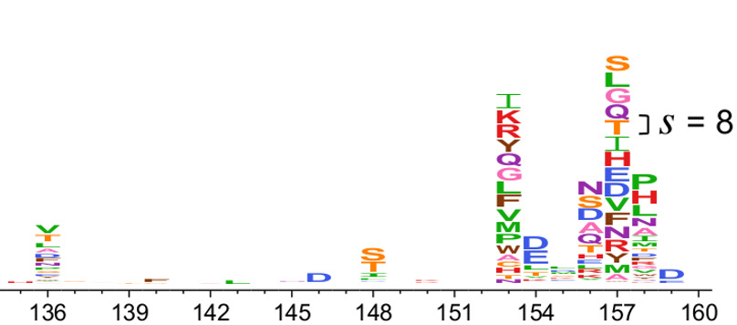

.. _diffsel:

==========================================
Differential selection
==========================================

.. contents::
   :local:
   :depth: 2

Overview
-------------
Deep mutational scanning libraries are often subject to multiple different selection pressures with the goal of identifying mutations that are differentially selected in one condition versus the other.
For instance, you might select a library of viral mutants with a monoclonal antibody, and also perform a mock selection without antibody.

One way to quantify the differential selection on mutations in the selected versus mock condition is in terms of the *differential selection* measure defined here.
A visualization of differential selection is shown in :numref:`diffselsnippetfig`.
Essentially, most mutations are **not** selected differently in the selected (e.g., antibody) treatment versus the mock selection -- but a small number are under strong differential selection.

.. _diffselsnippetfig:

   Visualization of differential selection created using :ref:`dms2_logoplot`.
   The height of each letter above the center line is proportional to the differential selection for that amino acid.
   For instance, at site 154 there is differential selection mostly for negatively charged amino acids (aspartic acid - D, glutamic acid - E), whereas at site 157 there is differential selection for most mutations.
   At other sites (such as 151), there is no differential selection for any mutation.
   The scale bar indicates a differential selection of 8, which corresponds to a :math:`2^8 = 256`-fold enrichment of the mutation.
   Figure from `Doud et al (2017)`_.
   Note that this figure only shows **positive** differential selection (mutations that are favored in the selected versus mock condition).

The `dms_tools2`_ software contains programs to estimate the differential selection from the counts of mutations generated from the deep sequencing data.
Typically you would want to estimate the differential selection using :ref:`dms2_batch_diffsel`, which in turn calls :ref:`dms2_diffsel`.
These programs create visualizations of the results, and you can also visualize the differential selection with :ref:`dms2_logoplot` as in :numref:`diffselsnippetfig`.

Definition of differential selection
---------------------------------------------
The definition of *differential selection* used here was originally introduced in `Doud et al (2017)`_.
A schematic of the overall integrated experimental and computational workflow is shown in :numref:`diffselworkflowfig`.

.. _diffselworkflowfig:

.. figure:: _static/DiffSelWorkflow.jpg
   :figwidth: 90%
   :align: center
   :alt: Schematic of differential selection.

   Schematic of differential selection.
   **(A)** A library of mutants is subjected to a selection (antibody neutralization) and also a mock-selection (no-antibody control).
   The mutants that survive each selection are deep sequenced, and the counts of mutations relative to wildtype are analyzed to identify mutations enriched in the antibody versus no-antibody treatment.
   **(B)** A differential selection value is computed for each mutation, and can be displayed in logo plots using :ref:`dms2_logoplot`.
   The height of each letter is proportional to the differential selection for that mutation, and is termed the *mutation differential selection*.
   The overall height of the letter stack is termed the *site differential selection*.
   Figure from `Doud et al (2017)`_.

Formula for differential selection
+++++++++++++++++++++++++++++++++++++
For each site :math:`r` in the gene, let :math:`n_{r,x}^{\rm{mock}}` be the number of observed counts of character :math:`x` (e.g., an amino acid) at site :math:`r` in the mock-treated condition, and let :math:`n_{r,x}^{\rm{selected}}` be the number of observed counts of :math:`x` at :math:`r` in the selected condition.
Let :math:`\operatorname{wt}\left(r\right)` be denote the wildtype character at :math:`r`.
Then the relative enrichment of the mutant relative to the wildtype after selection is

.. math::
   :label: E_rx
     
    E_{r,x} = \frac{\left(n_{r,x}^{\rm{selected}} + f_{r, \rm{selected}} \times P\right) / \left(n_{r,\operatorname{wt}\left(r\right)}^{\rm{selected}} + f_{r, \rm{selected}} \times P\right)}{\left(n_{r,x}^{\rm{mock}} + f_{r, \rm{mock}} \times P\right) / \left(n_{r,\operatorname{wt}\left(r\right)}^{\rm{mock}} + f_{r, \rm{mock}} \times P\right)}

where :math:`P > 0` is a pseudocount that is added to each observed count (specified by ``--pseudocount`` option to :ref:`dms2_diffsel` / :ref:`dms2_batch_diffsel`), and :math:`f_{r, \rm{selected}}` and :math:`f_{r, \rm{mock}}` are defined so that the pseudocount is scaled up for the library (*mock* or *selected*) with higher depth at site :math:`r`:

.. math::
   :label: f_rselected

   f_{r, \rm{selected}} = \max\left[1, \left(\sum_x n_{r,x}^{\rm{selected}}\right) / \left(\sum_x n_{r,x}^{\rm{mock}}\right)\right]

.. math::
   :label: f_rmock

   f_{r, \rm{mock}} = \max\left[1, \left(\sum_x n_{r,x}^{\rm{mock}}\right) / \left(\sum_x n_{r,x}^{\rm{selected}}\right)\right].

The reason for scaling the pseudocount by library depth is that the *mock* and *selected* libraries may often be sequenced at different depths. 
If the same pseudocount is added to both, then estimates of :math:`E_{r,x}` will be systematically different than one even if the relative counts for the wildtype and mutant amino acid are the same in both two conditions. 
Scaling the pseudocounts by the ratio of depths fixes this problem. 
Larger values of the pseudocount :math:`P` will avoid spuriously estimating differential selection when there is just statistical noise due to low counts, but this comes at the cost of reducing sensitivity.
If you are using ``--chartype`` of ``codon_to_aa``, the counts for amino acids are aggregated **before** doing the calculations above.

Note that by definition, :math:`E_{r,\operatorname{wt}\left(r\right)}` is always one.

We quantify the *differential selection* :math:`s_{r,x}` for the mutation to :math:`x` at site :math:`r` in the selected versus control condition as:

.. math::
   :label: mutdiffsel

   s_{r,x} = \log_2 E_{r,x}

These :math:`s_{r,x}` are reported as the *mutation differential selection* values by :ref:`dms2_diffsel` / :ref:`dms2_batch_diffsel`, and can be plotted in the logo plots above using :ref:`dms2_logoplot`.
When :math:`s_{r,x} > 0`, then :math:`x` is more favored in the selection versus mock condition.
When :math:`s_{r,x} < 0`, then :math:`x` is less favored in the selection versus mock condition.
By definition, :math:`s_{r,\operatorname{wt}\left(r\right)}` is always zero.

There is a mutation differential selection value for each mutation at a site -- for instance, there will be 19 such values for amino acid characters (the wildtype value is always one by definition).
For visualization and analysis, it is sometimes useful to summarize the mutation differential selection values at a site with a single number.
This can be done in several ways:

1. We define *absolute site differential selection* in terms of the *mutation differential selection* values at that site as

   .. math::
      :label: abs_diffsel

      \mbox{abs_diffsel} = \sum_x \left|s_{r,x}\right|.

   The absolute site differential selection is equivalent to the total height of the letter stack in both the positive and negative directions in logoplots such as :numref:`diffselsnippetfig`.

2. We define *positive site differential selection* in terms of the *mutation differential selection* values at that site as

   .. math::
      :label: positive_diffsel

      \mbox{positive_diffsel} = \sum_x \max\left(0, s_{r,x}\right).

   The positive site differential selection is equivalent to the total height of the letter stack in just the positive direction in logoplots such as :numref:`diffselsnippetfig`.

3. We define *negative site differential selection* in terms of the *mutation differential selection* values at that site as

   .. math::
      :label: negative_diffsel

      \mbox{negative_diffsel} = \sum_x \min\left(0, s_{r,x}\right).

   The negative site differential selection is equivalent to the total height of the letter stack in just the negative direction in logoplots such as :numref:`diffselsnippetfig`.

4. We define *maximum site differential selection* in terms of the *mutation differential selection* values at that site as

   .. math::
      :label: max_diffsel

      \mbox{max_diffsel} = \sum_x \max\left(0, \max_x\left(s_{r,x}\right)\right).

   The maximum site differential selection is equivalent to the tallest letter in the positive direction in logoplots such as :numref:`diffselsnippetfig`, or zero if no letters are in the positive direction.

5. We define *minimum site differential selection* in terms of the *mutation differential selection* values at that site as

   .. math::
      :label: min_diffsel

      \mbox{min_diffsel} = \sum_x \min\left(0, \min_x\left(s_{r,x}\right)\right).

   The maximum site differential selection is equivalent to the tallest letter in the negative direction in logoplots such as :numref:`diffselsnippetfig`, or zero if no letters are in the negative direction.

Error correction
++++++++++++++++++++++++
You can optionally correct for the potential inflation of some counts by sequencing errors by using the ``--err`` option to :ref:`dms2_diffsel` / :ref:`dms2_batch_diffsel`.
To do this, you should use some control where the **only** mutations will come from sequencing / library-prep-induced errors that are presumed to occur at the same rate as the actual samples being analyzed.
Typically, this would be deep sequencing of a wildtype control.

With an error control, the counts are adjusted as follows.
Let :math:`n_{r,x}` be the counts for character :math:`x` at site :math:`r` in the *mock* or *selected* sample.
Let :math:`n^{\rm{err}}_{r,x}` be the number of counts of :math:`x` at site :math:`r` in the error control.
Define

.. math::
   :label: epsilon

   \epsilon_{r,x} = \left(n^{\rm{err}}_{r,x}\right) / \left(\sum_y n^{\rm{err}}_{r,y}\right).

When :math:`x \ne \operatorname{wt}\left(r\right)` then :math:`\epsilon_{r,x}` is the rate of errors to :math:`x` at site :math:`r`, and when :math:`x = \operatorname{wt}\left(r\right)` then :math:`\epsilon_{r,x}` is one minus the rate of errors away from the wildtype at site :math:`r`.

We then adjust observed counts :math:`n_{r,x}` to the error-corrected counts :math:`\hat{n}_{r,x}` by

.. math::
   :label: n_rx_adjusted

   \hat{n}_{r,x} = \begin{cases}
   \max\left[\left(\sum_y n_{r,y}\right) \left(\frac{n_{r,x}}{\sum_y n_{r,y}} - \epsilon_{r,x}\right), 0\right] & \mbox{if } x \ne \operatorname{wt}\left(r\right) \\
   n_{r,x} / \epsilon_{r,x} & \mbox{if } x = \operatorname{wt}\left(r\right) \\
   \end{cases}

These adjusted counts are then used in place of the un-adjusted counts in Equation :eq:`E_rx` above.

Note that if you are using ``--chartype`` of ``codon_to_aa``, the corrections are done on the codon counts, and these corrected codon counts are then aggregated into the amino acid counts before computing the differential selection.

Programs and examples
------------------------------------------
The `dms_tools2`_ software contains programs to analyze differential selection:

    * :ref:`dms2_diffsel` estimates differential selection from counts files.

    * :ref:`dms2_batch_diffsel` runs :ref:`dms2_diffsel` on a set of samples and summarizes the results. If you have multiple related replicates, it is easier to use :ref:`dms2_batch_diffsel` rather than runnning :ref:`dms2_diffsel` directly.

    * :ref:`dms2_logoplot` can be used to create logo plots that visualize differential selection.

Here are some example analyses:

    * `Doud2017 example`_

    * `Dingens2017 example`_

    * `Dingens2018 example`_

.. include:: weblinks.txt
